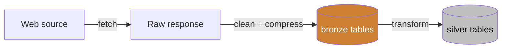
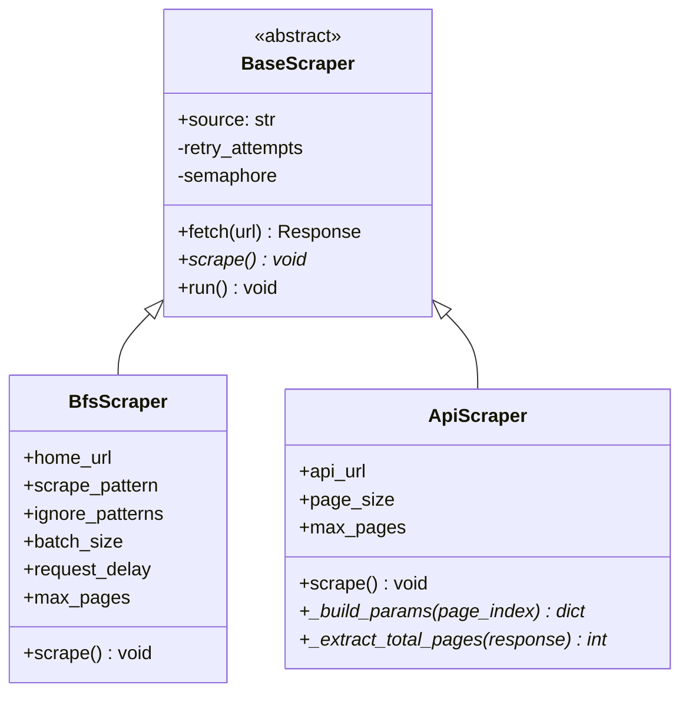

# the_scraper

Async web scraper framework for structured data collection from Paraguayan news sites and supermarkets. Built on a reusable core (`the_scraper`) that powers two applications: **noticias** (10 news sources) and **supermercados** (5 supermarket chains).

## Quick start

```bash
# Start PostgreSQL
docker compose up -d

# Install the framework
pip install -e .

# Install a project (from its directory)
cd noticias && pip install -e . && cd ..
cd supermercados && pip install -e . && cd ..

# Scrape
python -m noticias scrape --source lanacion abc
python -m supermercados scrape --source superseis

# Transform bronze -> silver
python -m noticias transform --source lanacion
python -m supermercados transform --source superseis
```

## Project structure

```
the_scraper/
├── src/the_scraper/           # Reusable framework
│   ├── scrapers/
│   │   ├── base.py            # BaseScraper (async HTTP, retry, concurrency)
│   │   ├── bfs.py             # BfsScraper (breadth-first HTML crawler)
│   │   └── api.py             # ApiScraper (paginated API fetcher)
│   ├── db.py                  # Async psycopg3 connection pool
│   ├── html_cleaner.py        # HTML stripping, compression, hashing
│   ├── parsing.py             # Shared HTML/JSON-LD parsing helpers
│   ├── storage.py             # Storage protocols + psycopg3 implementations
│   └── urls.py                # URL normalization and link extraction
├── noticias/                  # News scraper application
│   ├── scrapers/              # 10 news source scrapers
│   ├── parsers/               # Per-source JSON-to-article parsers
│   ├── config/scrapers/       # YAML configs per source
│   ├── pipeline/              # Bronze-to-silver transforms
│   └── main.py                # CLI entry point
├── supermercados/             # Supermarket scraper application
│   ├── scrapers/              # 5 store scrapers
│   ├── parsers/               # Per-store HTML-to-product parsers
│   ├── config/scrapers/       # YAML configs per store
│   ├── transforms/            # Bronze-to-silver transforms
│   └── main.py                # CLI entry point
├── sql/                       # Schema init scripts (mounted by Docker)
├── docker-compose.yml         # PostgreSQL 16
└── pyproject.toml             # Package metadata (Python >= 3.12)
```

## Architecture


## Data pipeline

Each application follows a **bronze/silver** medallion pattern: scrape raw data first, then parse it into structured tables.



| Stage | noticias | supermercados |
|-------|----------|---------------|
| **Scrape** | Paginated API calls -> compressed JSON | BFS crawl -> cleaned + compressed HTML |
| **Bronze** | `bronze.api_responses` | `bronze.snapshots` |
| **Transform** | Parse JSON -> articles | Parse HTML -> products |
| **Silver** | `silver.articles` | `silver.products` |

## Scraper types



**BfsScraper** — starts from a home URL, discovers all same-domain links, and stores cleaned HTML snapshots of pages matching a regex pattern. Used by `supermercados`.

**ApiScraper** — fetches paginated API endpoints, stores compressed JSON responses. Subclasses implement `_build_params` and `_extract_total_pages`. Used by `noticias`.

Both share: async HTTP with configurable concurrency, retry with exponential backoff, HTTPS-to-HTTP fallback, daily deduplication, and zlib compression.

## Adding a new project

A project is a standalone application (like `noticias` or `supermercados`) that uses the framework to scrape a specific domain.

### 1. Create the project directory

```
myproject/
├── scrapers/
│   ├── __init__.py        # Scraper registry
│   └── _base.py           # Project-level base classes
├── parsers/               # Per-source response parsers
├── config/scrapers/       # YAML configs per source
├── transforms/            # Bronze-to-silver parsing
└── main.py                # CLI entry point
```

### 2. Create project-level base classes

Wire the shared storage implementations and your config directory into the framework base classes in `scrapers/_base.py`:

```python
from pathlib import Path
from the_scraper.scrapers.bfs import BfsScraper as _BfsScraper
from the_scraper.scrapers.api import ApiScraper as _ApiScraper
from the_scraper.storage import PsycopgApiStorage, PsycopgSnapshotStorage

CONFIG_DIR = Path(__file__).resolve().parent.parent / "config" / "scrapers"

class BfsScraper(_BfsScraper):
    def __init__(self):
        super().__init__(storage=PsycopgSnapshotStorage(), config_dir=CONFIG_DIR)

class ApiScraper(_ApiScraper):
    def __init__(self):
        super().__init__(storage=PsycopgApiStorage(), config_dir=CONFIG_DIR)
```

### 3. Add a CLI entry point

See `noticias/main.py` or `supermercados/main.py` for the pattern: argparse with `scrape` and `transform` subcommands.

## Adding a new source

A source is a single website or API within an existing project.

### 1. Create the YAML config

Add `{project}/config/scrapers/{name}.yml`.

**For a BFS scraper** (HTML crawling):

```yaml
source: mynewstore
home_url: https://www.mynewstore.com.py
scrape_pattern: "/product/"
max_pages: 10000
batch_size: 20
request_delay: 0.5
ignore_patterns:
  - /login
  - /cart
  - /account
strip_tags:            # optional: override default tags to remove
  - style
  - noscript
  - svg
  - iframe
  - nav
  - header
  - footer
strip_classes:         # optional: CSS classes to remove
  - ad-banner
```

**For an API scraper** (paginated JSON):

```yaml
source: mynewssite
base_url: https://api.mynewssite.com.py
api_endpoint: /v1/articles
page_size: 100
max_pages: 5000
```

### 2. Create the scraper class

Create `{project}/scrapers/{name}.py`.

**BFS example** (most sites need no custom logic):

```python
from myproject.scrapers._base import BfsScraper

class MyNewStoreScraper(BfsScraper):
    source = "mynewstore"
```

**API example** (implement pagination logic):

```python
from myproject.scrapers._base import ApiScraper

class MyNewsSiteScraper(ApiScraper):
    source = "mynewssite"

    def _build_params(self, page_index: int) -> dict:
        return {"page": page_index, "size": self.page_size}

    def _extract_total_pages(self, response) -> int:
        return response.json()["total_pages"]
```

### 3. Add a transform

Write a parser in `{project}/transforms/` or `{project}/pipeline/` that reads from the bronze table, extracts structured fields, and inserts into the silver table.
