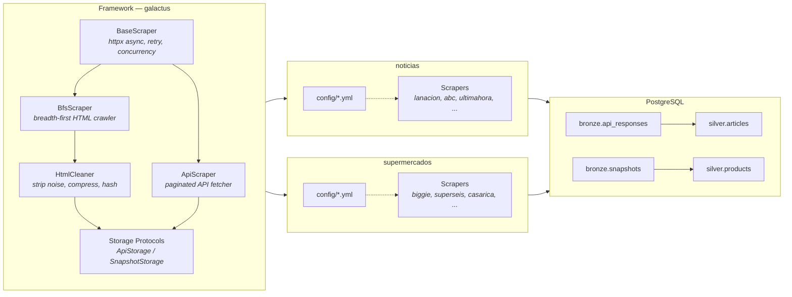
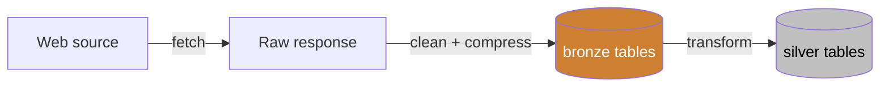
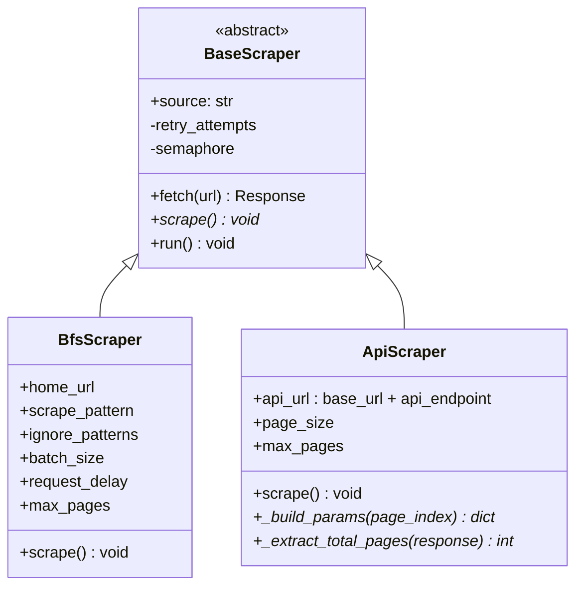

# galactus

<p align="center">
  
</p>

Async web scraper framework for structured data collection from Paraguayan news sites and supermarkets. Built on a reusable core (`galactus`) that powers two applications: **noticias** (10 news sources) and **supermercados** (5 supermarket chains).

## Quick start

```bash
# Environment (DB credentials, Airflow secrets — fill in the empty keys)
cp .env.example .env

# Start PostgreSQL + Airflow (scheduler, webserver, init)
docker compose up -d

# Install the framework (Python >= 3.12). Both projects are installed by this single step.
uv sync

# Apply DB migrations (one-off; docker compose also runs this automatically via the db-migrate service)
uv run galactus migrate

# Scrape
uv run galactus noticias scrape --source lanacion abc_color
uv run galactus supermercados scrape --source superseis

# Transform bronze -> silver
uv run galactus noticias transform --source lanacion
uv run galactus supermercados transform --source superseis

# Or do both in one go
uv run galactus noticias run-all --source lanacion
```

## Schema

Alembic is the single source of truth. Table definitions live in `migrations/schema/*.py` (SQLAlchemy `Table` objects consumed by autogenerate), and `migrations/versions/*.py` holds the revision history. `docker compose up -d` boots Postgres, then the `db-migrate` one-shot service runs `galactus migrate` (i.e. `alembic upgrade head`) before Airflow starts.

Outside Docker, apply changes with:

```bash
uv run galactus migrate                 # alembic upgrade head
uv run galactus current                 # print current revision
uv run galactus history                 # print revision graph
uv run galactus downgrade -n 1          # roll back one step
uv run galactus stamp <rev>             # mark revision applied without running
uv run galactus revision --autogenerate -m "message"
```

The Pydantic `Article` (`noticias/article.py`) and `Product` (`supermercados/product.py`) models are per-domain validation + persistence helpers, not SQL schema.

## Project structure

```
galactus/
├── src/galactus/              # Reusable framework
│   ├── scrapers/
│   │   ├── base.py            # BaseScraper (async HTTP, retry, concurrency)
│   │   ├── bfs.py             # BfsScraper (breadth-first HTML crawler)
│   │   └── api.py             # ApiScraper (paginated API fetcher)
│   ├── db.py                  # Async psycopg3 connection pool
│   ├── html_cleaner.py        # HTML stripping, compression, hashing
│   ├── logging.py             # Logging setup
│   ├── parsing.py             # Shared HTML/JSON-LD parsing helpers
│   ├── storage.py             # Storage protocols + psycopg3 implementations
│   └── urls.py                # URL normalization and link extraction
├── noticias/                  # News scraper application
│   ├── config.py              # Pydantic settings
│   ├── configs/               # YAML configs per source
│   ├── scrapers/              # 10 news source scrapers + _base.py
│   ├── parsers/               # Per-source parsers (HTML or JSON → article dict)
│   ├── transforms/            # Bronze → silver dispatch (bronze_to_silver.py)
│   └── __init__.py            # DomainSpec (registered into the `galactus` CLI)
├── supermercados/             # Supermarket scraper application
│   ├── config.py              # Pydantic settings
│   ├── configs/               # YAML configs per store
│   ├── scrapers/              # 5 store scrapers + _base.py
│   ├── parsers/               # Per-store parsers (HTML or JSON → product dict)
│   ├── transforms/            # Bronze → silver dispatch
│   └── __init__.py            # DomainSpec (registered into the `galactus` CLI)
├── airflow/                   # Airflow orchestration
│   ├── Dockerfile             # Bakes framework + both projects into the image
│   └── dags/                  # noticias_daily.py, supermercados_daily.py
├── sql/                       # Schema init scripts (mounted by Docker on first boot)
├── alembic.ini                # Alembic config (migrations/ script_location, DATABASE_URL via env.py)
├── migrations/                # Alembic migrations (env.py reads DATABASE_URL, psycopg3 driver)
├── docker-compose.yml         # PostgreSQL 16 + Airflow (init, scheduler, webserver)
├── pyproject.toml             # Package metadata (Python >= 3.12)
└── uv.lock                    # uv lockfile
```

## Architecture



## Data pipeline

Each application follows a **bronze/silver** medallion pattern: scrape raw data first, then parse it into structured tables.



| Stage | noticias | supermercados |
|-------|----------|---------------|
| **Scrape** | Paginated API calls -> compressed JSON | BFS crawl -> cleaned + compressed HTML |
| **Bronze** | `bronze.api_responses` | `bronze.snapshots` |
| **Transform** | Parse JSON -> articles | Parse HTML -> products |
| **Silver** | `silver.articles` | `silver.products` |

## Scraper types



**BfsScraper** — starts from a home URL, discovers all same-domain links, and stores cleaned HTML snapshots of pages matching a regex pattern. Used by every `supermercados` source and by the `noticias` sources that lack a usable JSON API (e.g. `ultimahora`, `cronica`, `npy`).

**ApiScraper** — fetches paginated API endpoints, stores compressed JSON responses. Subclasses implement `_build_params` and `_extract_total_pages`. Used by the `noticias` sources with public APIs (e.g. `abc_color`, `lanacion`, `hoy`, `latribuna`).

Both share: async HTTP with configurable concurrency, retry with exponential backoff, HTTPS-to-HTTP fallback, daily deduplication, and zlib compression.

## Adding a new project

A project is a standalone application (like `noticias` or `supermercados`) that uses the framework to scrape a specific domain.

### 1. Create the project directory

```
myproject/
├── scrapers/
│   ├── __init__.py        # Scraper registry
│   └── _base.py           # Project-level base classes
├── parsers/               # Per-source response parsers
├── configs/               # YAML configs per source
├── transforms/            # Bronze-to-silver parsing
└── main.py                # CLI entry point
```

### 2. Create project-level base classes

Wire the shared storage implementations and your config directory into the framework base classes in `scrapers/_base.py`:

```python
from pathlib import Path
from galactus.scrapers.bfs import BfsScraper as _BfsScraper
from galactus.scrapers.api import ApiScraper as _ApiScraper
from galactus.storage import PsycopgApiStorage, PsycopgSnapshotStorage

CONFIG_DIR = Path(__file__).resolve().parent.parent / "configs"

class BfsScraper(_BfsScraper):
    def __init__(self):
        super().__init__(storage=PsycopgSnapshotStorage(), config_dir=CONFIG_DIR)

class ApiScraper(_ApiScraper):
    def __init__(self):
        super().__init__(storage=PsycopgApiStorage(), config_dir=CONFIG_DIR)
```

### 3. Add a CLI entry point

See `noticias/__init__.py` or `supermercados/__init__.py` for the pattern: export a `DOMAIN: DomainSpec` and register it in `galactus.cli.main()`.

## Adding a new source

A source is a single website or API within an existing project.

### 1. Create the YAML config

Add `{project}/configs/{name}.yml`.

**For a BFS scraper** (HTML crawling):

```yaml
source: mynewstore
home_url: https://www.mynewstore.com.py
scrape_pattern: "/product/"
max_pages: 10000
batch_size: 20
request_delay: 0.5
ignore_patterns:
  - /login
  - /cart
  - /account
strip_path_prefixes:   # optional: trim these URL prefixes before storing
  - /catalogo/
strip_tags:            # optional: override default tags to remove
  - style
  - noscript
  - svg
  - iframe
  - nav
  - header
  - footer
strip_classes:         # optional: CSS classes to remove
  - ad-banner
```

**For an API scraper** (paginated JSON):

```yaml
source: mynewssite
base_url: https://api.mynewssite.com.py
api_endpoint: /v1/articles
page_size: 100
max_pages: 5000
```

### 2. Create the scraper class

Create `{project}/scrapers/{name}.py`.

**BFS example** (most sites need no custom logic):

```python
from myproject.scrapers._base import BfsScraper

class MyNewStoreScraper(BfsScraper):
    source = "mynewstore"
```

**API example** (implement pagination logic):

```python
from myproject.scrapers._base import ApiScraper

class MyNewsSiteScraper(ApiScraper):
    source = "mynewssite"

    def _build_params(self, page_index: int) -> dict:
        return {"page": page_index, "size": self.page_size}

    def _extract_total_pages(self, response) -> int:
        return response.json()["total_pages"]
```

Scrapers are discovered automatically: `{project}/scrapers/__init__.py` walks the package and registers any subclass of `BfsScraper` / `ApiScraper` that declares a `source` attribute. No manual registry edit needed.

### 3. Add a parser

Parsers live in `{project}/parsers/{name}.py` and are also auto-discovered. The dispatcher in `{project}/transforms/bronze_to_silver.py` reads rows from the bronze table, routes each one to the right parser by `source`, and writes structured rows into silver.

Each parser module must export a `parse()` function. The signature determines which bronze table it pulls from:

```python
# HTML parser (bronze.snapshots) — 2 args
SOURCE = "mynewstore"  # optional; defaults to the module name

def parse(html: str, url: str) -> dict | None:
    ...

# API parser (bronze.api_responses) — 1 arg
def parse(response_text: str) -> list[dict]:
    ...
```

## Orchestration (Airflow)

Daily per-source runs are orchestrated by Airflow, packaged alongside Postgres in the same `docker-compose.yml`.

### First-time setup

```bash
# 1. Copy the env template and fill in the two empty secrets
cp .env.example .env
uv run python -c "from cryptography.fernet import Fernet; print(Fernet.generate_key().decode())"  # -> AIRFLOW__CORE__FERNET_KEY
uv run python -c "import secrets; print(secrets.token_hex(32))"                                    # -> AIRFLOW__WEBSERVER__SECRET_KEY

# 2. Build and start everything
docker compose up -d --build

# 3. Open the UI
open http://localhost:8080   # login: admin / admin
```

The `airflow-init` service seeds the metadata DB and admin user, then exits. Scheduler and webserver keep running.

If you already have a `pgdata` volume from an earlier setup, the `00-airflow-db.sql` init script won't run (Postgres only runs init scripts on a fresh data dir). Create the database once manually:

```bash
docker compose exec db psql -U galactus -c "CREATE DATABASE airflow;"
```

### DAGs

| DAG | Schedule | Tasks |
|-----|----------|-------|
| `noticias_daily` | paused (`schedule=None`) during rollout — intended `0 1 * * *` UTC | one `run_<source>` BashOperator per news source |
| `supermercados_daily` | paused (`schedule=None`) during rollout | one `run_<source>` BashOperator per supermarket |

Both DAGs ship paused. Unpause them from the UI once you've verified a manual trigger works end-to-end, or flip `schedule=None` to a cron in the DAG file.

Each task shells out to the CLI from inside the Airflow image:

```bash
cd /opt/galactus && galactus noticias run-all --source <name>
cd /opt/galactus && galactus supermercados run-all --source <name>
```

`run-all` scrapes bronze and transforms to silver in a single task. Retries are 2 with 15-minute back-off and a 2-hour execution timeout.

### Rebuilding after source changes

The Airflow image copies `src/`, `noticias/`, and `supermercados/` into `/opt/galactus` at build time (see `airflow/Dockerfile`) — it does not mount them. After editing scraper/parser/transform code, rebuild:

```bash
docker compose up -d --build
```

DAG files under `airflow/dags/` are mounted, so changes there are picked up by the scheduler on its next scan with no rebuild.

### Adding or removing a source in orchestration

Edit the source list (`NOTICIAS_SOURCES` / `SUPERMERCADOS_SOURCES`) at the top of the relevant DAG file:

- `airflow/dags/noticias_daily.py`
- `airflow/dags/supermercados_daily.py`
